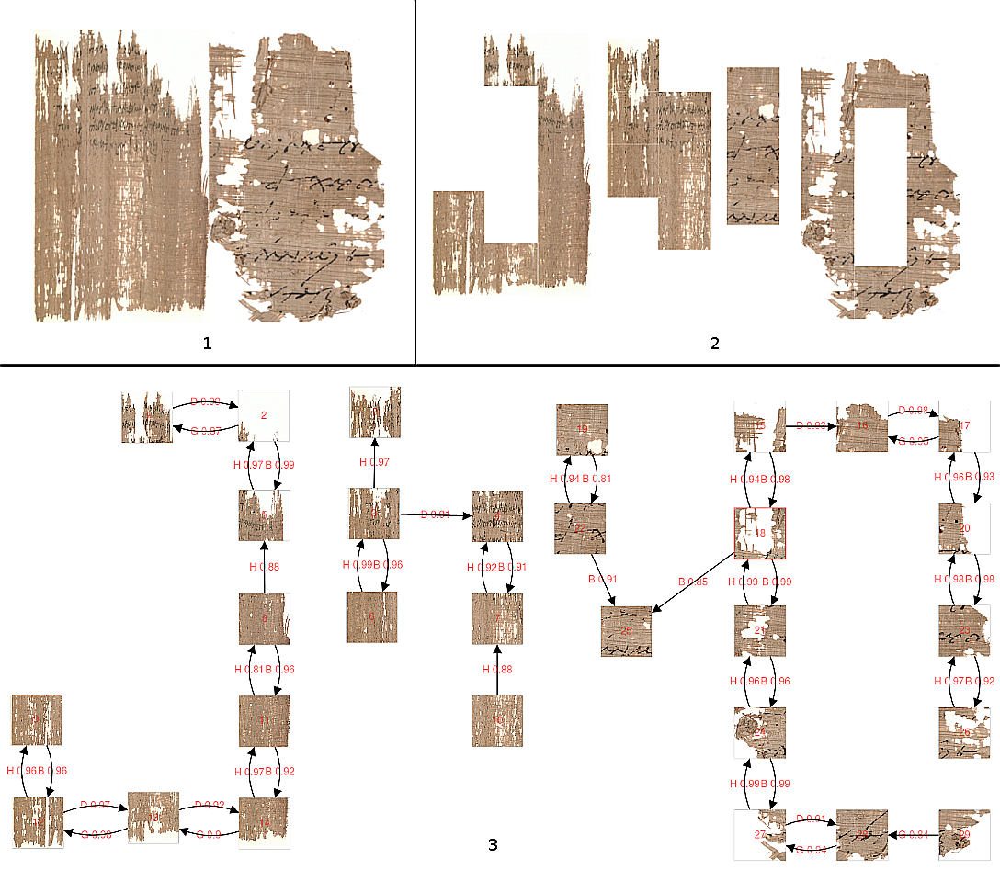

# VisuGraph

VisuGraph is an interactive user interface to visualize reconstruction proposals, as assembly graphs predicted by our AssemblyGraphNet model (from our paper Ostertag, Cecilia, and Marie Beurton-Aimar. "Using Graph Neural Networks to Reconstruct Ancient Documents." arXiv preprint arXiv:2011.07048 (2020).).

It is based on Cytoscape.js javascript library : https://js.cytoscape.org/#demos

Cytoscape.js: a graph theory library for visualisation and analysis

Franz M, Lopes CT, Huck G, Dong Y, Sumer O, Bader GD

Bioinformatics (2016) 32 (2): 309-311 first published online September 28, 2015 doi:10.1093/bioinformatics/btv557 (PDF)

PubMed abstract
